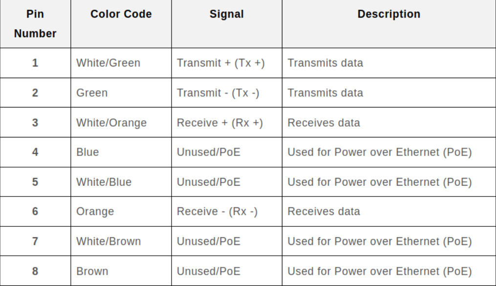
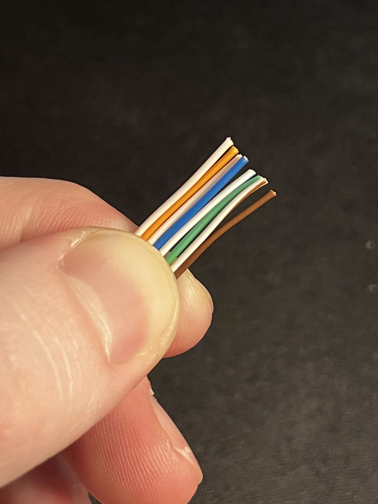

# Ethernet-Cable-Termination

It recently dawned on me that not only did I have no idea how Ethernet cables work, I also did not know how to crimp my own. So I decided to gather the materials and learn how to do so!

For this project I used the following listen below.

Ethernet Cable: [Utilitech 100ft Cat 6A](https://www.lowes.com/pd/Utilitech-UT-100ft-Black-Patch-Cable/5015158141)

RJ45 Connectors: [Cable Matters 50-Pack Pass Through RJ45 Connectors](https://www.amazon.com/dp/B0BT8HNWDM?ref=ppx_yo2ov_dt_b_fed_asin_title)

Ethernet Crimping Tool: [Cable Matters All-In-One Modular Ethernet Crimping Tool](https://www.amazon.com/dp/B0CH3TDJ4B?ref=ppx_yo2ov_dt_b_fed_asin_title)

Cable Tester: [Hiija Network Cable Tester](https://www.amazon.com/dp/B0G1WZRT8C?ref=ppx_yo2ov_dt_b_fed_asin_title)

Cable Jackets: Optional but I did not happen to grab any.    :(

I would like to note the importance of buying "pass through" connectors. This is because when inserting the wires through the connector they will slide right through it, making the process much easier.

### Wiring Standards & Pinout

First you will want to consider what standard you will be wiring with. The two widely recognized standards being T568A and T568B, the only difference between the two is which wires are transmitting data and which ones are receiving it. This being the green & white/green and orange & white/orange wires. In this tutorial I will be using T568B, I do not believe there is much of a difference. One thing to know is that both ends of the same cable NEED to follow the same convention.

Here is a neat chart from [msl-tw](https://www.msl-tw.com/news_detail/rj45-color-code.htm) that demonstrates what each of the pins do in T568B convention.

### Ethernet Makeup

Back to the crimping process, start by cutting your cable right down the middle if it has not been pre-cut. Then we can strip the wire with the built in stripping blade on the crimping tool. This will reveal the wires plus a divider and a thin metal wire called a "ripcord". This little cord does a great job of doing what it sounds like. When ripped it allows you to cut down the casing of the wire without using a knife and potentially damaging the wires. Once you remove the plastic divider and the ripcord, you will be left with something like this pictured below.

### Wire Ordering Tips

Then we get into the tricky part, ordering the wires to the specific convention you are using. Again I used T568B, so the order will be what is listed in the chart above. I find it helpful to first straighten the wires before ordering them. Once you manage to bunch them up, I find it easier to cut all of the wires with the wire cutter on the tool. This is optional but another thing that makes the process easier in the next step.

### Crimping

At this point it is good to double check the order of the wires. When this is confirmed, slide the wires through the connector with the clip on the top. Be sure that no wires are being caught or mixed in the process. Now that the wires have been fed through, I like the triple check to ensure the wires are right.  With this done, insert the components into the RJ45 socket on the tool and squeeze it to cut the excess wires off the cable. Again with the tool crimp the wire and connector together to lock it in place.

 

### Testing

Finally, plug both ends into your tester. The key thing you are looking for is that the lights are synced up on the master and remote. If yours looks like mine then you have successfully have terminated an RJ45 cable!

   
